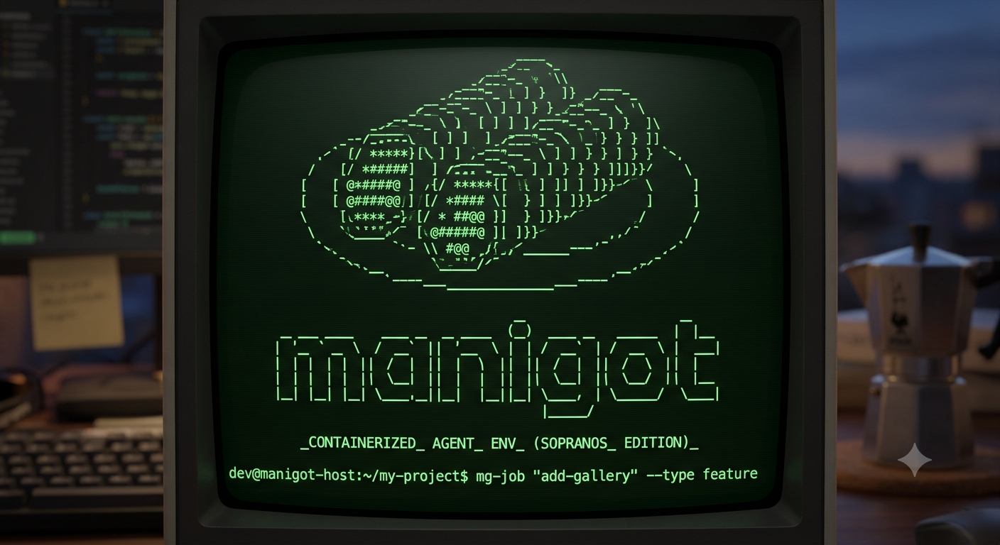

<p align="center">
  
</p>


Isolated agent environment per project. One Docker image, real filesystem
containment, structured agent workflow.

Runs a session under one of three **subscription profiles** — `claude-pro`
(Claude Code, billed to your Claude Pro/Max subscription), `zai` (OpenCode,
billed to your Z.AI Coding Plan), and `opencode-go` (OpenCode, billed to the
OpenCode Go subscription). Pick per session with `--profile`, set the default
used by bare `mg` with `mg profiles`, and configure credentials with
`mg setup`.

---

## Where everything lives

### The manigot repo

```
manigot/
  Dockerfile              ← build once, rebuild on Claude Code / OpenCode updates
  Makefile                ← build / rebuild / install / help; `make mg` builds bin/mg
  cmd/mg/                 ← the one host-side binary ('mg'); every command is a subcommand
                            (session, profiles, setup, agents, job, done, delete, diff, init, tui, jdi)
  internal/               ← the host-side logic as Go packages
    session/              ← docker launch construction (mounts, env, profiles)
    job/                  ← job lifecycle: create / finish / delete
    git/                  ← worktree/branch operations
    ui/                   ← the Bubble Tea TUI (reached via `mg tui`)
    orchestrate/          ← the `mg jdi` state machine
    config/               ← profiles table, .env, settings
    ...                   ← agentlist, cli, editor, home, launch, markdown, project
  scripts/                ← one script only
    entrypoint.sh         ← runs inside the container before the agent CLI starts
  bin/                    ← built binaries (gitignored) — `make mg` produces bin/mg
  .env                    ← your credentials + default profile (gitignored, never committed)
  .gitignore
  README.md
  agents/                 ← global agents, baked into the image for both tools
    analyst.md
    developer.md
    reviewer.md
    security.md
    owner.md
    designer.md
    quality.md
    prompter.md
    mentor.md
    architect.md
    devops.md
    sysadmin.md
    chat.md
  project-template/       ← copy this into each new project to get started (via `mg init`)
    docs/
      AGENTS.md
      CLAUDE.md
      jobs/               ← empty; `mg job` fills it
```

### Each project

```
your-project/
  docs/                         ← mounted into the container at runtime
                                  (at /workspace/.claude for Claude Code,
                                   /workspace/.opencode for OpenCode)
    AGENTS.md                   ← project context, loaded by whichever tool you run
                                  (CLAUDE.md still works as a fallback)
    agents/                     ← optional: override a global agent for this project only
      developer.md              ← same filename = this replaces the global one
    jobs/                     ← one directory per job
        a3f9k2_add-gallery/
          brief.md
          tasks.md
          implementation.md
          verdict.md
        7bx1q4_fix-uploads/
          brief.md
          tasks.md
          implementation.md
          verdict.md
  [rest of your project]
```

The agent can only see your project directory. SSH keys, `.env` files,
other projects — not mounted, not reachable. `.env` files inside the project
are shadowed with `/dev/null` at container start — host files are never touched.

`docs/` is optional. Run `mg` in a project with no `docs/` directory and you
still get a fully isolated, sandboxed session — just without project context
or the job workflow. Add `docs/` (see [Per-project setup](#per-project-setup))
whenever you want those too. This makes `mg` a drop-in replacement for
running `claude`/`opencode` directly, in any project, initialized or not.

---

## Setup (once)

### Profiles

A profile bundles an agent CLI with one of your subscriptions:

| Profile | Agent CLI | Billing | Credential in `.env` |
|---|---|---|---|
| `claude-pro` | Claude Code | Claude Pro/Max subscription | `CLAUDE_CODE_OAUTH_TOKEN` + account UUIDs |
| `zai` | OpenCode | Z.AI Coding Plan | `ZHIPU_API_KEY` |
| `opencode-go` | OpenCode | OpenCode Go subscription | `OPENCODE_API_KEY` |

The quickest way to get going:

```bash
cd manigot/
make build
mg setup              # interactive wizard: walks through each profile,
                      # auto-applying what it can read off your host (e.g.
                      # your Claude account from ~/.claude.json) and letting
                      # you paste the rest into manigot/.env
mg profiles           # see the three profiles, which are ready, and the default;
                      # on an interactive terminal it then lets you pick the
                      # default right there
mg profiles zai       # make bare `mg` use the zai profile
```

`mg setup <name>` sets up a single profile; `mg setup --check` reports status
non-interactively. Everything ends up in the same gitignored `manigot/.env`
that the session launcher reads. Manual instructions for each profile, if you'd
rather fill `.env` by hand:

```bash
# 1. Build the image
cd manigot/
make build

# 2. Put the launchers on your PATH
make install                            # /usr/local/bin — may need sudo
# make install PREFIX="$HOME/.local"    # ...or somewhere you own
```

### `claude-pro` — Claude Code, Claude Pro subscription

```bash
# 1. Extract your account info from your host (requires Claude Code installed locally)
cat ~/.claude.json | python3 -c "
import json,sys
d=json.load(sys.stdin)
print(json.dumps(d.get('oauthAccount'), indent=2))"

# 2. Add credentials to .env
# Get CLAUDE_CODE_OAUTH_TOKEN by running: claude setup-token
cat > manigot/.env << EOF
CLAUDE_CODE_OAUTH_TOKEN=sk-ant-oat01-...
CLAUDE_ACCOUNT_UUID=xxxxxxxx-xxxx-xxxx-xxxx-xxxxxxxxxxxx
CLAUDE_EMAIL=your@email.com
CLAUDE_ORG_UUID=xxxxxxxx-xxxx-xxxx-xxxx-xxxxxxxxxxxx
EOF
```

### `zai` — OpenCode, Z.AI Coding Plan

OpenCode is already in the image — no extra install. It authenticates from
environment variables, so add your Z.AI Coding Plan key to the same `.env`:

```bash
cat >> manigot/.env << EOF
ZHIPU_API_KEY=xxxxx.xxxxx      # Z.AI Coding Plan key

# optional: which model this profile defaults to, as provider/model
OPENCODE_ZAI_MODEL=zai-coding-plan/glm-5.2
EOF
```

### `opencode-go` — OpenCode, OpenCode Go subscription

OpenCode Go uses your OpenCode API key from [opencode.ai/auth](https://opencode.ai/auth),
billed against the Go subscription (the same key works for Zen — billing
follows your subscription):

```bash
cat >> manigot/.env << EOF
OPENCODE_API_KEY=sk-...        # your key from https://opencode.ai/auth

# optional: which model this profile defaults to, as provider/model.
# Go model ids use the opencode-go/ prefix (e.g. opencode-go/deepseek-v4-flash)
OPENCODE_GO_MODEL=opencode-go/glm-5.2
EOF
```

The `--profile` selector and `mg profiles`/`mg setup` are the supported way to
manage these. `--tool claude-code|opencode` is still accepted as a legacy
alias: `--tool claude-code` behaves exactly like `--profile claude-pro`, and
`--tool opencode` keeps its old behavior of forwarding every configured
OpenCode key and using `OPENCODE_MODEL` unchanged.

Note: `ANTHROPIC_API_KEY` is rejected on the claude-pro path — it would
override your subscription and bill per token. On the OpenCode profiles it is
ignored (only the profile's own key is forwarded).

### The installed commands

`make install` puts a single command, `mg`, on your `PATH`. It dispatches on
its first argument:

| command | does |
|---|---|
| `mg` | start a session in the current project (works with or without `docs/` — see above); uses the default profile, or the one given with `--profile` |
| `mg profiles` | list the three profiles (which are ready, and which is the default) — `mg profiles <name>` sets the default used by bare `mg`, or pick it interactively on a TTY; the TUI's settings screen shares the same default |
| `mg setup` | configure credentials for your subscriptions, interactively — `mg setup <name>` for one, `mg setup --check` for a non-interactive status report |
| `mg agents` | list available agents (global + any `docs/agents/` overrides/additions) and pick one to start a session in, via an interactive picker on a TTY (type to filter, enter to choose; thematic alias: `mg crew`, same command/behavior) |
| `mg init` | bootstrap this project for the job workflow — copies `docs/` from the template (unless already present) and optionally hands off to `@prompter` to draft `docs/AGENTS.md`; the one command that works **without** `docs/` already existing |
| `mg job` | create a job: directory + branch, checked out in the job's own worktree (off `main`); needs `docs/` |
| `mg jobs` | list open jobs with state and pick one to start a session in, via an interactive picker on a TTY (type to filter, enter to choose); the session launches in the agent appropriate to the job's stage (analyst/developer/reviewer); also surfaces orphaned worktrees (leftover `.manigot-worktrees/` dirs with no git registration) and offers to remove them; needs `docs/` |
| `mg done` | archive a finished job — merges it into the base branch and removes its worktree; needs `docs/` |
| `mg delete` | permanently delete a job (worktree + branch, no merge), or an orphaned worktree by its name; needs `docs/` |
| `mg diff` | show what a job's branch changed, three-dot against the base branch — log + `diff --stat` by default, `--name-only` for filenames, `--full` for the complete patch, `--tig` to browse it in tig on the host; needs `docs/` |
| `mg tui` | the terminal UI, running in-process; needs `docs/` |
| `mg jdi` | drive a job's `@analyst` → `@developer` → `@reviewer` sequence unattended, in-process; needs `docs/` (thematic alias: `mg made-man`, same command/behavior) |
| `mg host` | run a session directly on the host, without the docker container — the profile's CLI runs as-is from the project root, so the agent can touch the host itself (thematic alias: `mg wild`, same command/behavior) |
| `mg --help` | print usage and exit — no docker/auth setup touched |

`mg` is a symlink back into the repo, so `git pull` updates it. `make
uninstall` removes it again.

### Installing without symlinks

If you would rather not write to `/usr/local/bin`, define a shell alias
instead:

```bash
# ~/.zshrc or ~/.bashrc
alias mg='~/code/manigot/bin/mg'
```

The binary locates its own checkout (for `manigot/.env`, `config/`, `agents/`,
`assets/` and `project-template/`) from its own location, so an alias to
`bin/mg` needs no environment variables at all. `$MANIGOT_HOME` is still
honored as an explicit override if the binary is copied somewhere unusual.

---

## Per-project setup

```bash
cd your-project/
mg init
```

`mg init` copies `docs/AGENTS.md`, `docs/CLAUDE.md`, and an empty `docs/jobs/`
from `project-template/docs/` into your project (skipping the copy — and
reporting "already initialized" — if `docs/` already exists), then offers to
hand off to `@prompter` to read your project and draft a concrete
`docs/AGENTS.md` for you (`y`/`N`, defaults to no). Run it again any time to
get that offer without re-copying. Add `--profile zai` (or any other profile)
to run the prompter hand-off under that subscription instead of claude-pro.

Equivalent manual steps, if you'd rather not run the prompter or want more
control:

```bash
# Copy the template into your project
cp -r manigot/project-template/docs/ your-project/docs/

# Fill in your project context
$EDITOR your-project/docs/AGENTS.md
```

Either way, that's it. The global agents are already in the image — nothing
else to copy.

`docs/AGENTS.md` is the one project context file, and it works for both tools:
manigot mounts it read-only at whatever path the selected CLI reads context
from (`/workspace/AGENTS.md` for OpenCode, `/workspace/.claude/CLAUDE.md` for
Claude Code). Projects that still have a `docs/CLAUDE.md` keep working — it is
used as a fallback when `docs/AGENTS.md` is absent.

---

## Usage

```bash
# Bootstrap a project for the job workflow (one-time, see Per-project setup)
cd your-project/
mg init

# Start a manigot session (run from anywhere, in any project — docs/ optional)
mg                            # the default profile (claude-pro), or whatever `mg profiles` set
mg --profile zai              # this session on your Z.AI Coding Plan
mg --profile opencode-go      # this session on your OpenCode Go subscription
mg profiles                   # list profiles + the current default (then pick a new one on a TTY)
mg setup --check              # which profiles are ready to use

# List all commands
mg --help

# Start straight in an agent, or on a job
mg --agent analyst
mg -a analyst                      # same as --agent analyst
mg --profile zai --job a3f9k2
mg -j a3f9k2                       # same as --job a3f9k2

# Start an agent with an ad-hoc initial prompt, outside the job workflow
mg --agent prompter --prompt "help me write a good project prompt"

# Create a new job
mg job "add image gallery block"
mg job "fix tenant isolation on media uploads" --type fix
mg job "upgrade dependencies" --type chore

# Archive a finished job
mg done a3f9k2

# Drive a job unattended: @analyst -> @developer -> @reviewer, end to end
mg jdi --job a3f9k2
mg jdi -j a3f9k2                     # same as --job a3f9k2

# Run a session on the host — no docker container (work that must touch the host)
mg host
mg host --job a3f9k2              # same flags as a docker session, host-pathed job prompt
mg wild --profile zai             # thematic alias, same command/behavior
```

Three ways to seed a session's initial prompt: `--job <id>` (the job's
`brief.md`, for the job workflow), `--agent <name>` (starts the CLI directly
in that agent, with no prompt text of its own), and `--prompt "…"` (a
free-form initial prompt for an ad-hoc, non-job session — what `mg init` uses
to hand off to `@prompter`). `--job` and `--agent` also accept the short forms
`-j <id>` and `-a <name>`. All three are tool-neutral: the session launcher
routes the prompt to the right place per tool (positional for Claude Code,
`--prompt` for OpenCode) regardless of which of `--job`/`--prompt` you used to
set it. `--job` and `--prompt` can't both be honored at once — if you pass
both, the job prompt wins.

---

## Choosing a profile

A profile bundles the agent CLI with the subscription it is billed against.
`--profile claude-pro` (default), `--profile zai`, or `--profile opencode-go`.
What differs per profile:

| | `claude-pro` | `zai` / `opencode-go` |
|---|---|---|
| CLI in container | `claude` | `opencode` |
| Auth | `CLAUDE_CODE_OAUTH_TOKEN` + account UUIDs (Claude subscription) | `ZHIPU_API_KEY` / `OPENCODE_API_KEY` |
| Onboarding | bypassed by writing `~/.claude.json` | nothing to bypass |
| Permissions | auto-approved via `--dangerously-skip-permissions` | auto-approved via `--auto` |
| Global agents | `~/.claude/agents/` | `~/.config/opencode/agents/` |
| `docs/` mounted at | `/workspace/.claude` | `/workspace/.opencode` |
| Project agents | `/workspace/.claude/agents/` | `/workspace/.opencode/agents/` |
| `docs/AGENTS.md` mounted at | `/workspace/.claude/CLAUDE.md` | `/workspace/AGENTS.md` |
| Initial job prompt | positional argument | `--prompt` |
| Billing | your Claude subscription | your Z.AI Coding Plan / OpenCode Go subscription |
| Non-interactive (`--print` / `mg jdi`) | supported | supported |

Both tools get the same `agents/*.md` files baked in at build time. The
OpenCode copies are generated from the same sources with the `name` and `tools`
frontmatter keys removed, since OpenCode derives the agent name from the
filename and uses a different schema for tool permissions. Custom project
agents in `your-project/docs/agents/` are written in the same list form and
converted the same way at session launch — manigot strips `name`/`tools` from
the mounted copies before an OpenCode session sees them (OpenCode hard-errors
on the list form, so this is what keeps one file working under both CLIs).
Your `docs/agents/` source files are never modified.

The read-only agents — `@reviewer`, `@security`, `@analyst` and `@owner` —
express their restriction in both tools' schemas: the Claude-Code `tools:`
list under Claude Code, and an OpenCode `permission:` frontmatter block that
the strip leaves intact, so the same `agents/*.md` source file enforces
read-only under OpenCode too. Under OpenCode the reviewer/security/analyst
can edit only their own report file (`verdict.md`/`tasks.md`) and run only
read-only git commands; `task`, `webfetch`, `websearch` and `question` are
denied. Everything is auto-approved except these explicit denies — the
container is isolated and ephemeral, so this is safe: Claude Code runs with
`--dangerously-skip-permissions`, OpenCode with `--auto` (which auto-approves
anything not explicitly denied; the container's opencode config defines no
denies). `mg host` runs without the container and therefore without these
flags — see [Host mode](#host-mode-mg-host).

---

### Host mode (`mg host`)

Most sessions run inside the isolated Docker container. `mg host` (thematic
alias: `mg wild`) is the deliberate exception: it launches the profile's
agent CLI directly on the host — no container, no image, no mounts — as a
launcher for work that must touch the host itself.

- It reuses the same session machinery: `--profile`, `--agent` (`-a`),
  `--job` (`-j`), `--prompt` and passthrough behave exactly as in a docker
  session, and the credentials resolve the same way — the profile's keys go
  into the CLI's environment, nothing is written to your config.
- The CLI runs from the resolved project root (the job's worktree with
  `--job`), and the job prompt names the job's **host** path.
- The CLI must be installed on the host — the docker path has both CLIs in
  the image. `mg host` fails with a clear error if it is not.
- **No auto-approval flags.** The container path starts Claude Code with
  `--dangerously-skip-permissions` and OpenCode with `--auto`, safe only
  because the container is isolated and ephemeral. On the host there is no
  isolation, so `mg host` deliberately does not pass them: the CLI keeps its
  normal per-tool confirmation prompts and you supervise every action.
- **Agents.** manigot's global agents are baked into the container image,
  not installed on the host — `--agent` works only if the host's own CLI has
  that agent installed (it errors clearly otherwise).
- **OpenCode model.** The zai/opencode-go profiles' plan model is forwarded
  via opencode's `--model` flag; mg never writes your host's opencode
  config.
- **`--print` stays a container path.** `mg host --print` is rejected with a
  clear error — non-interactive runs (and `mg jdi`) still use the container.

---

## Clipboard / copying from agent sessions

Copying text from inside an agent session (selecting agent output, the
"copied" indicator) relies on the **OSC 52** terminal escape sequence
(`ESC ] 52 ; c ; <base64> BEL`): the agent CLIs are full-screen TUIs inside
the Docker container, and the only way such an app can write the *host* OS
clipboard is by emitting OSC 52, which flows container TUI → docker pty →
docker client → host terminal (possibly through tmux). mg forwards the bytes
unmodified — the prerequisites are on the terminal side:

- **Your terminal emulator must support OSC 52.** Most modern terminals do
  (iTerm2, kitty, WezTerm, Windows Terminal, recent VTE-based terminals, ...);
  some older or minimal terminals ignore the sequence entirely. A terminal
  without OSC 52 support cannot be fixed by mg.
- **tmux needs `set-clipboard on` when the session runs inside tmux.** tmux
  intercepts all pane output; with `set-clipboard off` (the pre-tmux-3.2
  default and a common deliberate setting) the OSC 52 sequence is stripped and
  your host clipboard is never touched — while the app still shows "copied".
  Fix it with `tmux set -g set-clipboard on` (or `external` on tmux ≥ 3.2,
  which forwards to the outer terminal). mg detects this at session start and
  prints a warning on stderr when it finds `set-clipboard off` — strictly
  read-only, mg never mutates your tmux state.

To make the in-container TUIs see the real terminal — the identity many of
them key their copy/clipboard behavior off — mg forwards the host's terminal
environment into the container: `TERM`, `COLORTERM`, `TERM_PROGRAM`,
`TERM_PROGRAM_VERSION`, `VTE_VERSION`, `KITTY_WINDOW_ID`, `TMUX`, `TMUX_PANE`,
`WT_SESSION`, and every `WEZTERM_*` variable, each forwarded only when set and
non-empty on the host. OpenCode additionally switches to tmux's
DCS-passthrough OSC 52 form when `TMUX` is set. `mg host` sessions are
unaffected — the CLI runs on the host with the full environment already
present.

---

## Agents

Thirteen agents are available globally in every project. Call them with `@name`
in your session, or run `mg agents` (or its thematic alias, `mg crew`) from
the host to list them (with any `docs/agents/` overrides) and pick one —
via the interactive picker on a TTY — to start straight into.

| Agent | Role | Tools (Claude Code) |
|---|---|---|
| `@analyst` | Breaks a brief into atomic tasks | read-only |
| `@developer` | Implements one task at a time | read + write |
| `@reviewer` | Verifies implementation against tasks | read-only |
| `@security` | Audits for vulnerabilities | read-only |
| `@owner` | Evaluates features from the user's perspective | read-only |
| `@designer` | Reviews and directs UI/UX — typography, colour, layout | read + write |
| `@quality` | Reviews code quality — readability, DRY, modularity | read + write |
| `@prompter` | Crafts and refines prompts for LLMs and agents | read + write |
| `@mentor` | Grounded tech mentor for skill growth and sustainable practice | read-only |
| `@architect` | Plans how to best build a system — stack, components, deployment | read-only |
| `@devops` | Expert for pipelines and getting things running — CI/CD, builds | read + write |
| `@sysadmin` | Manages and administers servers — services, TLS, updates, uptime | read + write |
| `@chat` | General chat assistant, like ChatGPT — conversational and advisory | read-only |

The Tools column is enforced under Claude Code; the read-only agents are
enforced under OpenCode too, via the `permission:` frontmatter they carry —
see [Choosing a profile](#choosing-a-profile).

To override an agent for a specific project, create a file with the same name
in `your-project/docs/agents/`. Project agents take precedence over global ones.
Write them in the same format as the built-ins (`name:`, `description:`,
`tools: Read, Grep, ...`) — the OpenCode copy is generated from that file at
launch, so you never need to hand-write OpenCode's object form.

---

## Job workflow

Each piece of work gets its own directory under `docs/jobs/`,
named with an English-word ID (e.g. `flower`, never re-used across open or
archived jobs) and a slugified title. A git branch is
created automatically with the same ID, checked out in the job's **own git
worktree** — a sibling directory of the project root, under
`<parent>/.manigot-worktrees/<project-name>/` — so every job gets its own
directory and multiple jobs can be worked on (interactively or via
`mg jdi`) in parallel, while the project root stays on the base branch.

```bash
mg job "add image gallery block"
# creates: docs/jobs/flower_add-image-gallery-block/   (inside the job's worktree)
#   brief.md    ← you fill in: what and why
#   tasks.md    ← @analyst fills in: atomic task breakdown
#   implementation.md  ← @developer fills in: what was implemented
#   verdict.md  ← @reviewer and/or @security fill in: pass/fail per task
# creates branch: feature/flower_add-image-gallery-block
# creates worktree: ../.manigot-worktrees/<project>/flower_add-image-gallery-block
```

**Typical flow for a feature:**

```
1.  mg job "feature name"               → creates dir + branch
2.  Fill in brief.md
3.  @owner                              → SHIP / REVISIT / REJECT
4.  @analyst                            → writes tasks.md
5.  Review tasks.md yourself
6.  @developer TASK-1                   → implements, commits [ID] TASK-1: ...
7.  @developer TASK-2                   → implements, commits [ID] TASK-2: ...
8.  @reviewer                           → reads diff, writes verdict.md
9.  @security                           → appends security findings to verdict.md
10. Fix anything blocking, re-run 8–9
11. Merge branch when verdict is APPROVED
12. Update status: open → done in brief.md
```

**For a bug fix, skip steps 3–4 and go straight to the developer.**

`mg jobs` lists every open job and lets you pick one; the session then starts
in the agent appropriate to the job's stage — `@analyst` while it's being
planned, `@developer` while it's being implemented, `@reviewer` once there's
work to review (an explicit `mg jobs --agent <name>` always wins).

Job types: `feature` (default), `fix`, `chore`.
Branch naming: `feature/ID_slug`, `fix/ID_slug`, `chore/ID_slug` — or
`<prefix>/<type>/<id>_<slug>` when the project sets `jobBranchPrefix` in
`.manigot/manigot.json` (e.g. `jobs/feature/ab12cd_x`), which lets projects
with a pre-existing plain branch named `feature`/`fix`/`chore` keep using the
job workflow.

### How to get a job done

1. **Open the case.** `mg job "job name"` cuts you a directory, a branch, and
   a worktree to keep the job in.
2. **Write the brief.** Fill in `brief.md` — the job, and why it needs doing.
3. **Run it past the boss.** `@owner` calls it: SHIP / REVISIT /
   REJECT.
4. **Case the job.** `@analyst` breaks it into a task list.
5. **Read the plan yourself** before anyone touches code.
6. **Send in the crew.** `mg crew` rounds up an agent — `@developer` does the
   actual work, one task at a time, committing as it goes, safe inside its
   own safehouse where nothing outside the project is reachable.
7. **Get it checked.** `@reviewer`, then `@security`, go over the work and
   write the verdict.
8. **Clean up loose ends.** Fix what's blocking, run it past them again.
9. **Close it out.** Merge once the verdict's APPROVED, mark the brief done.

A job scaffolded and then abandoned leaves a **dead worktree directory**
behind — a `.manigot-worktrees/` dir whose git registration is gone, with no
branch and no entry in `mg jobs`. `mg jobs` surfaces these orphans and offers
to remove them, and `mg delete <name>` removes one by name — both with the
same "This cannot be undone." confirmation as a normal delete. `mg done` and
`mg delete` (and orphan removal) also clean up the job's `mg jdi` status
sidecar and `run.log` under `.manigot/jdi-status/` — the archive keeps the
job's docs, and `mg jdi` never runs against a finished or deleted job, so the
sidecar would otherwise be dead weight forever.

Don't feel like babysitting the whole thing? Send `mg made-man --job <id>`
instead — it runs the analyst, the developer, and the reviewer back to back,
on its own, and still won't touch the merge button without you.
### Autonomous mode (`mg jdi`)

Steps 4–8 above — `@analyst` → `@developer` → `@reviewer` — can run
unattended instead of one agent at a time:

```bash
mg jdi --job a3f9k2
```

(`mg made-man --job a3f9k2` is a purely thematic alias of the same command —
same script, same behavior.)

It drives that fixed sequence, the same one regardless of job `type`, in a
loop: ask what's next given the job's current stage and verdict history, run
that agent non-interactively, check whether it needs a human, repeat. It
stops — never auto-merging; you still merge the branch yourself via `mg done`
(and `mg jdi` never checks anything out in the project root — every job's own
worktree is resolved per invocation) — when:

- `verdict.md`'s `## Overall` says **APPROVED**, or
- a REJECTED/NEEDS WORK verdict bounces back to `@developer` **once**, and
  the re-review still isn't APPROVED — no further retries, or
- an agent decides it's blocked and can't proceed without you: it prints a
  line starting with exactly `NEEDS-HUMAN-INPUT:` followed by why (a
  convention only `--print`/`mg jdi` invocations ask for — an ordinary
  interactive session never sees this instruction and just asks its
  question in conversation, since you're right there to answer it), or
- the same agent makes no progress on two consecutive runs (a stall
  backstop, independent of the marker above).

`@owner` and `@security` are not part of the sequence `mg jdi`
drives — both stay available as ordinary agents, unaffected.

`mg jdi` runs under the `claude-pro` profile by default; pass `--profile
zai` or `--profile opencode-go` to drive the sequence under an OpenCode
subscription instead:

```bash
mg jdi --job a3f9k2 --profile zai
```

The TUI's `j` keybinding (see below) passes its settings profile — the shared
`MANIGOT_PROFILE` default — the same way `@name` agent launches already do;
no separate configuration needed there.

**Watching a run.** A direct `mg jdi --job <id>` run streams each agent's
output to its own terminal as each invocation completes, and rings the
terminal bell when it stops. One honesty note: `claude --print` returns an
agent's *final response text* per invocation, not a blow-by-blow of every
tool call/file edit — so this is "see each agent's final answer as it comes
in," not a live diff of its work. A TUI-launched run (see below) has no
terminal of its own at all — the list's status badge and the detail view's
log tab are how you watch it there instead.

**Getting notified.** When `mg jdi` runs unattended on a VPS, you don't want
to watch the terminal for it to stop. Set `NTFY_TOPIC` in `manigot/.env`
(`mg setup` walks you through the three keys) and it pushes an ntfy
notification to your phone whenever a run stops: a success notification when
it finishes, a high-priority attention one when it stops needing a human —
and, at the next run's start, if it finds the previous run crashed or
killed. `NTFY_URL` defaults to `https://ntfy.sh`; `NTFY_TOKEN` is optional
(sent as a `Bearer` auth header). Notifications are opt-in: without
`NTFY_TOPIC`, nothing is sent and behavior is unchanged.

---

## TUI

manigot ships an optional terminal UI for browsing jobs and launching agents
without remembering command syntax. It is **host-side**: it runs on your
machine as `mg tui` (in-process — no separate binary), reads a project's
`docs/jobs/`, and launches sessions through the same in-process session
launcher the CLI uses. It does **not** run in the container and needs no
credentials itself.

Every open job lives in its own **git worktree** (see
[Job workflow](#job-workflow)) — one worktree per job branch, created by
`mg job` and removed by `mg done`/`mg delete` — so the job list is
discovered straight from `git worktree list`: each worktree's
`docs/jobs/` is read off its own disk, and the project root's own working
tree stays on the base branch. There is no "wrong branch checked out" state
to worry about: every action — editing a brief, launching an agent, marking
done, deleting — targets the job's own worktree directly, so nothing is ever
guarded on the currently checked-out branch.

### Supported platforms

macOS and Linux. Firing an agent opens `mg --profile <profile> --agent <name>
--job <id>` in a new terminal (`<profile>` from the settings screen — see
below), picked in this order:

1. a **tmux** split pane in the TUI's own window, if the TUI is itself running
   inside tmux (`$TMUX` set) — each new launch replaces the pane manigot opened
   before, so at most one agent pane exists at a time. Inside tmux this always
   wins, even when a **Terminal** is set (see below): the session opens in a
   tmux pane, never in a separate window.
2. the **Terminal** from the settings screen (`s` from the job list), when
   set — applied only when the TUI is NOT inside tmux
3. **Terminal.app** via `osascript` on macOS
4. a Linux terminal emulator — `gnome-terminal`, `x-terminal-emulator`,
   `konsole`, or `xterm`, whichever is found first on `PATH`

Setting a **Terminal** in the settings screen (`s` from the job list)
replaces the macOS/Linux auto-detect chain above (steps 3–4). It only applies
when the TUI is not running inside tmux: inside tmux the split-pane behavior
wins, so a session launched from a TUI inside tmux always opens in a tmux
pane. Leave it blank to keep auto-detect behavior.

The list view's `o` shortcut (see Keybindings) opens a bare `mg --profile
<profile>` instead — same spawn paths, but with no agent and no job, for a quick ad-hoc
session that isn't tied to a specific job's workflow. `a` is the middle
ground: it opens a picker of every agent available to the project (global
`agents/*.md`, with any `docs/agents/` overrides/additions swapped in — the
same set `mg agents` lists), then launches the one you pick the same way `o`
does, `mg --profile <profile> --agent <name>`, still with no `--job`.

Windows is not supported in this version.

### Build & install

```bash
cd manigot/
make mg         # builds bin/mg — the one binary, covering mg tui, mg jdi, ...
make install    # puts the single mg binary on your PATH
```

`make mg` builds the single static `bin/mg` binary (requires Go 1.23+ and
network access the first time, to fetch the Charm modules). `make install`
symlinks it onto your `PATH`; `mg tui` and `mg jdi` are subcommands of that
same binary, so no other artifacts or wrapper scripts exist.

### Run

```bash
cd your-project/
mg tui                # from anywhere inside a project that has a docs/
```

### Keybindings

List view:

| key | action |
|---|---|
| `↑`/`↓` | move selection |
| `enter` | open the job's detail view |
| `j` | run `mg jdi` against the selected job, detached in the background — watch via the list's status badge (see [Autonomous mode](#autonomous-mode-mg-jdi) and [mg jdi status & log](#mg-jdi-status--log) below) |
| `o` | launch a quick manigot session (no agent, no job) |
| `a` | pick any agent and launch it as a quick session (no job) |
| `n` | create a new job (runs the in-process job lifecycle) |
| `s` | open settings (editor, subscription profile) |
| `ctrl+r` | refresh — re-read job files from disk |
| `q` | quit |

Detail view:

| key | action |
|---|---|
| `tab` / `1`-`6` | switch tab: brief · tasks · implementation · verdict · log · diff |
| `pgup`/`pgdn`, `home`/`G` | scroll |
| `p` `a` `d` `r` `s` | run the agent shown in the action bar (Owner, Analyst, Developer, Reviewer, Security — all five are always available, regardless of the job's stage) |
| `e` | edit `brief.md` in `$EDITOR` (only on the brief tab — tasks/implementation/verdict/log/diff are agent-, mg jdi-, or TUI-computed) |
| `D` | mark the job done — shows an in-TUI confirmation, then runs the in-process finish lifecycle (squash-merge + archive) |
| `j` | run `mg jdi` against this job, detached in the background — no window is opened; watch it via the log tab or the list's status badge (see [Autonomous mode](#autonomous-mode-mg-jdi) and [mg jdi status & log](#mg-jdi-status--log) below) |
| `x` / `del` | permanently delete the job — shows an in-TUI confirmation (with a dirty-worktree warning when the job's worktree has uncommitted changes), then runs the in-process delete lifecycle. `x` exists because the physical Delete/Entf key's escape sequence isn't decoded consistently by every terminal — both trigger the same action |
| `P` | push this job's branch to `origin` (`git push -u origin <branch>`) — a quick way to make it visible on another host via `git pull` |
| `t` | open the job's branch diff in tig (`mg diff <id> --tig`) — spawns in a tmux split pane / new terminal like agent launches; only available when tig is installed on the host |
| `c` | commit all uncommitted changes in this job's worktree (`git add -A` + `git commit` with a `[<id>] chore: commit all` message) — a catch-all sweep for the files agents sometimes leave behind, so `D`'s clean-tree check isn't tripped |
| `g` | open the git panel — pick one of the detail view's git commands for this job's worktree: commit all, push to origin, or merge default branch (see below) |
| `ctrl+r` | refresh |
| `esc` | back to list |

The **log** tab shows `mg jdi`'s `run.log` for this job — one section per
agent invocation, with a timestamp/agent/attempt header; the attempt number
counts that agent's invocations within the run (per agent, not per run), so
a bounce back to the developer shows that developer's second call as attempt
2. It reads
"_no mg jdi run has happened for this job yet_" until the first `mg jdi` run
against it; large files are tailed, not loaded in full. Never editable.

The **diff** tab is the TUI's representation of `mg diff <id>`: it computes
what the job's branch changed relative to the project's base branch — the
same quick eyeball the CLI prints by default (`git log --oneline` followed by
`git diff --stat` over the three-dot range `<base>...<branch>`, per
[docs/GIT_DIFF.md](docs/GIT_DIFF.md)), so you can review the job's changes
in the TUI before marking it done with `D`. The base branch resolves exactly
as `mg diff` does — the project's configured `baseBranch`, falling back to
`origin/HEAD` → `main` — and the tab degrades instead of crashing: a job
with no branch (not a git worktree job) or a git error shows a plain-text
placeholder, and an undiverged branch reads "No changes on `<branch>`
relative to `<base>`." It is recomputed on every `ctrl+r`, so newly
committed changes appear on refresh. Never editable.

Below the footer, the job view also shows a **git-log strip** — the same dim
`shortHash  subject  relTime  branch` lines the job list's recent-activity
strip renders at the bottom of the screen, scoped to just this job's own
branch (`git.BranchCommits`, the job-branch counterpart of the list's
cross-branch `git.RecentCommits`). It is refreshed when the job opens and on
`ctrl+r`, sized like the list's strip (up to the settings'
recent-activity count, floor of one line), and disappears entirely for a
job with no branch or a project that isn't a git repo.

The **git panel** (`g`) is a small modal listing the detail view's git
commands — **Commit all**, **Push to origin**, and **Merge default branch**
— one per row, moved through with `↑`/`↓` and run with `enter`
(`esc`/`q` cancels back to the detail view). The first two are the same
actions as the `c`/`P` accelerators; **Merge default branch** brings a job's
worktree up to speed before starting work: it runs `git merge --no-edit`
inside the job's own worktree, merging in the project's locally-resolved
base branch (the configured `baseBranch`, falling back to `origin/HEAD` →
`main` — the same local base the diff tab diffs against and `D` merges into).
It never fetches, so it merges whatever state that base branch is in
locally; a worktree that is already up to date is a successful no-op, and a
merge conflict leaves the tree in git's conflicted state for you to resolve
manually (the detail view's status line reports the conflict).

`e` resolves the editor to run as: the settings screen's Editor field (see
below), if set; otherwise `$VISUAL`, then `$EDITOR`, then whichever of
`nano`/`vi` is found first on `PATH`.

New-job form: type a title, `tab` to the type field and use `←`/`→` to pick
`feature`/`fix`/`chore`, `enter` to create, `esc` to cancel.

### Settings

Press `s` from the job list to open the settings screen:

- **Editor** — the command `e` (in the detail view) runs to open `brief.md`.
  Leave blank to fall back to `$VISUAL`/`$EDITOR`/`nano`/`vi`.
- **Profile** — `claude-pro`, `zai`, or `opencode-go`, cycled with `←`/`→`
  (the selected profile's tool, model, and billing are shown beneath the list).
  Selects which subscription firing an agent from the action bar launches
  (adds `--profile` to the `mg --agent ... --job ...` command the same way
  `mg --profile zai` would on the command line). It is stored as
  `MANIGOT_PROFILE` in `manigot/.env` — the one default shared between CLI and
  TUI — so switching it here also switches what bare `mg` uses, and a profile
  set with `mg profiles` shows up here.

`tab` moves between fields, `enter` saves, `esc` discards. The editor persists
to `config/tui-settings.json` and the profile to `manigot/.env` as
`MANIGOT_PROFILE` (both gitignored, both in the manigot checkout) and apply
immediately; a missing file just means nothing has been saved yet, and every
setting falls back to its default above.

### Stage timeline

The detail view's action bar shows a horizontal timeline of every stage —
done stages checked, the current one highlighted, stages still ahead dim —
as an informational hint of where the job's files say it is in the ideal
workflow above. It no longer restricts which agents can be launched from
there. Any of the five agents can be fired at any time, so a job worked on
outside the ideal flow (e.g. a hand-written `brief.md` and `tasks.md`,
straight to `@developer`) isn't blocked by the TUI.

| stage | when |
|---|---|
| define | `brief.md` not yet written |
| plan | `brief.md` written, `tasks.md` not yet |
| implement | `tasks.md` written, `implementation.md` not yet |
| review | `implementation.md` written, `verdict.md` not yet |
| finished | `verdict.md` written and its `## Overall` verdict is APPROVED |

A file counts as "written" once it has real content beyond its `mg job`
scaffold (template comments, empty headings, and frontmatter don't count). A
verdict that's written but not approved (REJECTED, NEEDS WORK, or anything
else) bounces the stage back to implement rather than resolving to review or
finished — the job needs more work before it goes through review again.

Press `D` from the detail view at any point to mark the job done: a
confirmation screen (showing the job's verdict warning when a verdict is
missing or not approved — the same warnings the CLI's `mg done` shows) leads
to the in-process finish lifecycle, which squash-merges the job branch into
the default branch, archives the job directory under `docs/jobs/archive/`,
and sets `status: done`. This is available from any stage too.

### mg jdi status & log

Press `j` in the list (on the selected job) or in the detail view to start
[`mg jdi`](#autonomous-mode-mg-jdi) against that job. Unlike the agent-launch
keys above, this opens **no
terminal window at all** — `mg jdi` has no interactive session for a human
or a subprocess to attach to, so it runs fully detached in the background.
Two places show you what it's doing instead, both polled the same
refresh-triggered way as everything else in the TUI (pressing `ctrl+r`,
returning to the list, etc. — no separate live-streaming subsystem). The one
exception is a narrow timer-driven redraw that runs *only while a run is
active*, driving the animated indicator below:

- **List-row badge** — a `[running @<agent>]`, `[finished]`, or
  `[needs human]` tag next to a job's row.
  While a run is active the running badge is prefixed
  with an animated activity indicator — a small spinner
  (`⠋ [running @<agent>]`), the same idea as the one opencode shows in its
  bottom-left corner — so a watched run visibly indicates it's alive instead
  of sitting as a static tag that only changes on the next refresh. Shown
  only while there's something live or recent
  to report; a stale status left behind by a killed `mg jdi` process is
  never shown as if it were current.
- **Log tab** — see [Keybindings](#keybindings) above.

**Notification.** A direct `mg jdi --job <id>` run rings the terminal bell
itself when it stops (see [Autonomous mode](#autonomous-mode-mg-jdi)). A
`j`-launched run has no terminal to ring into, so the TUI rings it instead,
on its own next poll, the first time it notices that job's status turn into
`finished` or `needs human` — once per fresh stop, not on every poll while
it stays stopped, and never for a job that was already stopped before this
TUI session started watching it.

---

## Rebuilding

When Claude Code or OpenCode releases an update worth taking:

```bash
cd manigot/
make rebuild
```

The image also ships `make` and the Go toolchain (Debian trixie's `golang-go`,
currently Go 1.24) so the host-side tool in `cmd/` can be built and tested from
inside a container. `GOTOOLCHAIN=local` is set, so if `go.mod` ever requires a
newer Go than the image has, the build fails loudly instead of silently
downloading one.

The Go module cache is pre-warmed at build time from `go.mod` and `go.sum`,
which means `make mg` and `go test ./...` work inside the container without
network access — but also that **bumping a dependency requires a `make
rebuild`**, otherwise the new module is missing from the cache.